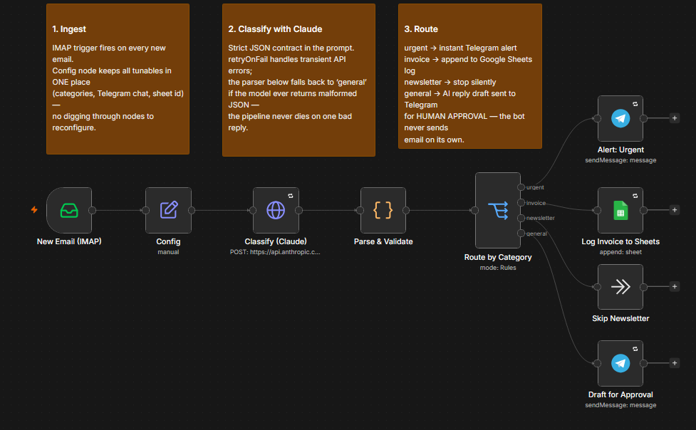
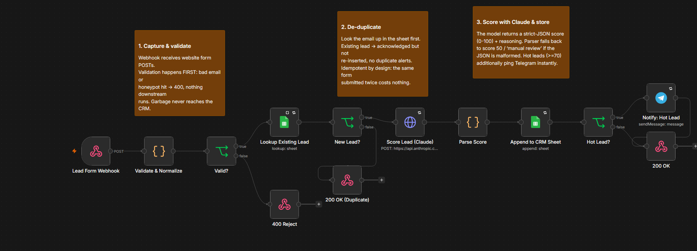
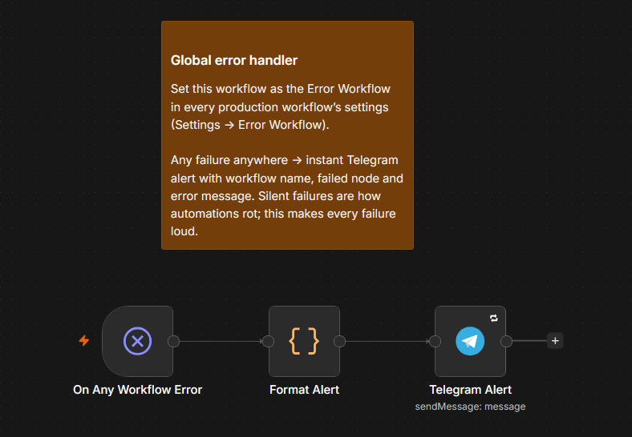

# n8n Workflows — Production Patterns

A small library of n8n automations built the way client work should be
built: credentials instead of hardcoded keys, hard fallbacks around every
LLM call, human-in-the-loop before anything irreversible, de-duplication,
and loud failures via a global error handler.

Import any workflow from [`workflows/`](workflows/) into n8n
(**Workflows → Import from File**), re-link your credentials, and replace
the `YOUR_*` placeholders in the Config/parameter fields.

## Workflows

### 1. AI Email Triage & Assisted Reply
`workflows/ai-email-triage.json`

Watches an inbox over IMAP and classifies every incoming email with Claude
into `urgent / invoice / newsletter / general`, then routes:

- **urgent** → instant Telegram alert
- **invoice** → appended to a Google Sheets log
- **newsletter** → silently skipped
- **general** → Claude drafts a reply, which is sent to Telegram **for
  human approval** — the bot never sends email on its own

Patterns worth stealing: single `Config` node for all tunables; a strict
JSON contract in the prompt plus a parser that degrades to `general`
instead of crashing when the model misbehaves; `retryOnFail` on every
external call.

### 2. Lead Intake, De-dup & AI Scoring
`workflows/lead-intake-scoring.json`

A webhook endpoint for website contact forms:

1. Validates and normalizes the submission (email regex, honeypot
   anti-spam field, length caps) — junk gets a `400` and never touches
   the CRM
2. Looks the email up in Google Sheets first — duplicates are
   acknowledged but not re-inserted (idempotent by design)
3. Scores the lead 0–100 with Claude (fit + intent) with a
   manual-review fallback if the output is malformed
4. Appends to the CRM sheet; leads scoring ≥ 70 additionally trigger an
   instant 🔥 Telegram notification
5. Responds to the form with proper status codes in every branch

### 3. Global Error Handler
`workflows/error-alert-handler.json`

Set as the **Error Workflow** in every production workflow's settings.
Any failure, anywhere, becomes an immediate Telegram message with the
workflow name, failed node and error text. Silent failures are how
automations rot — this makes every failure loud.

## Credentials used

| Credential | Used by |
|---|---|
| IMAP account | email triage trigger |
| Anthropic API key (`x-api-key` header auth) | classification, lead scoring |
| Telegram Bot token | alerts, approval messages |
| Google Sheets OAuth2 | invoice log, CRM sheet |

No API keys live inside any workflow JSON — everything runs through n8n's
credential store, so these files are safe to share and version.

## Design principles

- **LLM output is untrusted input.** Every model call has a strict JSON
  contract in the prompt *and* a try/catch parser with a safe fallback.
  One malformed reply must never kill a pipeline.
- **Human-in-the-loop for irreversible actions.** Drafts go to a person;
  the automation never sends email or messages third parties on its own.
- **Idempotency.** Re-delivered webhooks and duplicate form submissions
  are absorbed, not duplicated.
- **Fail loudly.** Retries for transient errors, a global error workflow
  for everything else.
